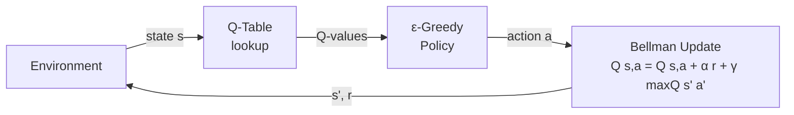
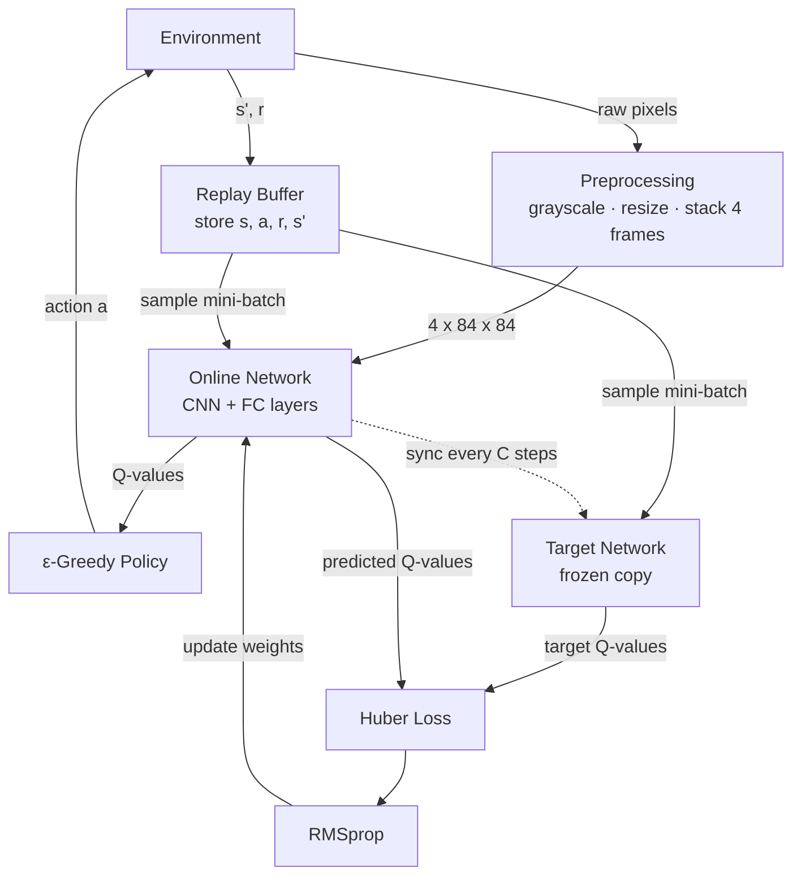

# rl-games-tutorials

Tutorials and experiments on reinforcement learning, from tabular methods to deep learning approaches.

---

## Q-Learning

Q-Learning is a tabular, model-free RL algorithm. The agent maintains a **Q-table** that maps every (state, action) pair to an expected cumulative reward. At each step it picks an action via an **ε-greedy policy**, observes the reward and next state, and updates the table using the **Bellman equation**.

| Component | Role |
|---|---|
| **Q-Table** | Stores Q(s, a) for every discrete state-action pair |
| **ε-Greedy Policy** | Balances exploration (random) vs exploitation (argmax Q) |
| **Bellman Update** | `Q(s,a) ← Q(s,a) + α [ r + γ max Q(s',a') - Q(s,a) ]` |

> **Limitation:** the Q-table grows with the state space. For continuous or high-dimensional inputs (e.g. raw pixels) it becomes infeasible.

---

## Deep Q-Network (DQN)

DQN replaces the Q-table with a **neural network** that approximates Q-values for any input. Two key techniques stabilise training: **experience replay** (randomly sampling past transitions to break correlation) and a **target network** (a frozen copy used to compute stable Bellman targets).

| Component | Role |
|---|---|
| **Preprocessing** | Grayscale + resize to 84×84, stack 4 frames to encode motion |
| **Online Network** | CNN mapping stacked frames to Q-values; updated every step |
| **ε-Greedy Policy** | ε annealed linearly from 1.0 → 0.05 during training |
| **Replay Buffer** | Ring buffer of `(s, a, r, s')` transitions; random mini-batch sampled each update |
| **Target Network** | Frozen copy of online network; provides stable Q targets, synced every C steps |
| **Huber Loss** | `L = HuberLoss( Q(s,a), r + γ max Q(s',a') )` |
| **RMSprop** | Updates online network weights via gradient descent |

---

## Tutorials

- **Snake Game - Q-Learning** [`web/posts/snake_game/`]: Tabular Q-learning on a discrete grid environment.
- **Flappy Bird - DQN** [`web/posts/flappy-bird-dqn.html`]: Image-based and state-based DQN on a continuous action environment.
