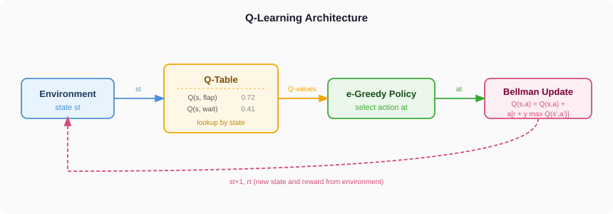
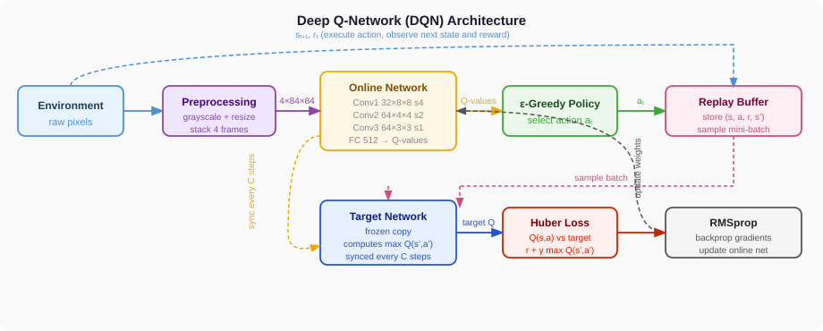

# rl-games-tutorials

Tutorials and experiments on reinforcement learning, from tabular methods to deep learning approaches.

---

## Q-Learning

Q-Learning is a tabular, model-free RL algorithm. The agent maintains a **Q-table** that maps every (state, action) pair to an expected cumulative reward. At each step it picks an action via an **ε-greedy policy** (random with probability ε, greedy otherwise), observes the reward and next state, and updates the relevant table entry using the **Bellman equation**.

| Component | Role |
|---|---|
| **Environment** | Returns current state and reward after each action |
| **Q-Table** | Stores Q(s, a) for every discrete state-action pair |
| **ε-Greedy Policy** | Balances exploration (random) vs exploitation (argmax Q) |
| **Bellman Update** | `Q(s,a) ← Q(s,a) + α [ r + γ max Q(s',a') - Q(s,a) ]` |

Limitation: the Q-table grows with the state space. For continuous or high-dimensional inputs (e.g. raw pixels), it becomes infeasible.

---

## Deep Q-Network (DQN)

DQN replaces the Q-table with a **neural network** that approximates Q-values for any input, making it possible to learn directly from raw pixel frames. Two key techniques stabilise training: **experience replay** (storing and randomly sampling past transitions to break correlation) and a **target network** (a frozen copy of the online network used to compute stable Bellman targets).

| Component | Role |
|---|---|
| **Preprocessing** | Convert RGB frames to grayscale 84x84, stack 4 consecutive frames to encode motion |
| **Online Network** | CNN that maps stacked frames to Q-values; updated every step via backprop |
| **ε-Greedy Policy** | Same exploration strategy as Q-learning, ε annealed linearly during training |
| **Replay Buffer** | Ring buffer storing `(s, a, r, s')` transitions; random mini-batch sampled each update |
| **Target Network** | Frozen copy of the online network; provides stable Q targets, synced every C steps |
| **Loss (Huber)** | `L = HuberLoss( Q(s,a),  r + γ max Q(s',a') )` - less sensitive to outliers than MSE |
| **RMSprop** | Optimizer that updates the online network weights via gradient descent |

---

## Tutorials

- **Snake Game - Q-Learning** [`web/posts/snake_game/`]: Tabular Q-learning on a discrete grid environment.
- **Flappy Bird - DQN** [`web/posts/flappy-bird-dqn.html`]: Image-based and state-based DQN on a continuous action environment.
