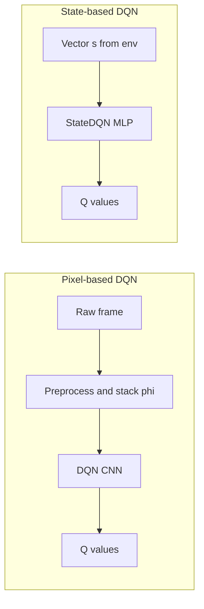
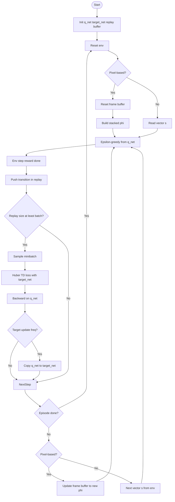

# Deep Q-Learning (DQN) for Flappy Bird: Algorithm Specification

This document maps the coursework checklist in [`ALGO-HC.md`](../../ALGO-HC.md) to this folder: inputs/outputs, steps, algorithm type, design rationale, properties, complexity, data structures, tests, flowcharts, and proposed efficiency improvements.

**Reference code:** Both variants are implemented in **[`algorithm/dqn.ipynb`](algorithm/dqn.ipynb)**: **pixel-based** (`DQN`, CNN on stacked frames) and **state-based** (`StateDQN`, MLP on a low-dimensional vector from `env.observation_space`). Packaged Python includes [`preprocessing.py`](preprocessing.py) for file-based pixel pipelines. A separate [`tests/notebook.ipynb`](tests/notebook.ipynb) may exist for experiments; cite **`algorithm/dqn.ipynb`** for coursework.

## 1. Two algorithms: pixel-based vs. state-based

Both are **deep Q-learning** with replay and a target network; they differ only in **how the environment observation is represented** and **which function approximator** maps that representation to Q-values.

| | **Pixel-based DQN** | **State-based DQN** |
| --- | --- | --- |
| **Observation** | Raw game image → preprocessed frames; motion via max over consecutive frames | Vector `s ∈ ℝ^d` from Gymnasium (e.g. `d = 12` for Flappy in the notebook) |
| **State fed to Q** | Stacked tensor **φ**, shape `(4, 84, 84)` after `FrameBuffer` | Single vector **s**, shape `(d,)` — no frame stacking |
| **Network** | `DQN`: `Conv2d` stack + FC heads (Nature DQN–style) | `StateDQN`: fully connected layers (`Linear` → ReLU → … → `num_actions`) |
| **Notebook classes** | `DQN`, `DQNAgent`, `DQNTrainer` | `StateDQN`, `StateDQNAgent`, `StateDQNTrainer` |
| **When to use** | Learn from pixels when no compact state is given; matches classic Atari DQN | Cheaper and simpler when the env exposes a small informative vector |

The **TD backup**, **replay buffer**, **ε-greedy behavior**, **Huber loss**, and **periodic target-network copy** are the same in spirit for both; only tensor shapes and the forward pass architecture change.

### Shared hyperparameters (typical notebook defaults)

| Parameter | Role |
| --- | --- |
| `γ` | Discount (e.g. `0.99`) |
| Learning rate, optimizer | e.g. RMSprop on `q_net` |
| `batch_size` | Minibatch size for replay (e.g. `32`) |
| `target_update_freq` | Steps between `target_net ← q_net` |
| ε-schedule | From high exploration to lower (e.g. `1.0` → `0.1` over many steps) |
| Replay | `deque` or similar FIFO buffer |

### Outputs (both variants)

- **Q-network weights** (`q_net`) and **target network** (`target_net`).
- **Training loss** per step (Smooth L1 / Huber on TD error).
- **Policy**: ε-greedy during training; greedy `argmax_a Q(s,a)` or `Q(φ,a)` at test time.

---

### 1a. Pixel-based algorithm (image observations)

**Idea:** Learn Q(φ, a) where **φ** is a short **history of downscaled grayscale frames** so velocity and motion are visible without explicit state variables.

**Inputs**

| Input | Role |
| --- | --- |
| RGB frames | From `env.render()` or image files |
| Stacked φ | Four consecutive preprocessed frames, shape `(4, 84, 84)` (float32 after normalization in the notebook) |

**Numbered procedure**

1. **Preprocess** each raw frame to `84 × 84` (file-based [`preprocessing.py`](preprocessing.py) with max over two frames, or `preprocess_frame` on RGB in the notebook).
2. **Stack** in `FrameBuffer` → φ with shape `(4, 84, 84)`.
3. **Select action** with `DQNAgent`: ε-random or `argmax_a Q(φ, a)` from **`DQN`** (CNN).
4. **Environment step** → reward, next observation, `done`.
5. **Replay** stores `(φ, a, r, φ′, done)`.
6. **`DQNTrainer.train_step`**: TD target uses `target_net(φ′)`; Huber loss; periodic target sync.
7. **Repeat** until stopping criterion (see training cells in [`algorithm/dqn.ipynb`](algorithm/dqn.ipynb)).

**Illustrations:** [`illustrations/preprocessing_step.svg`](illustrations/preprocessing_step.svg), [`illustrations/dqn.svg`](illustrations/dqn.svg).

---

### 1b. State-based algorithm (vector observations)

**Idea:** When the environment exposes a **fixed-size vector** (positions, velocities, pipe layout, etc.), approximate Q(s, a) with an **MLP** — no convolutions or frame history.

**Inputs**

| Input | Role |
| --- | --- |
| `s` | One `env.step` observation; dimension `state_dim = env.observation_space.shape[0]` (e.g. **12** in the notebook) |

**Numbered procedure**

1. **Read** vector observation `s` (no `FrameBuffer`; no image preprocessing).
2. **Select action** with `StateDQNAgent`: ε-random or `argmax_a Q(s, a)` from **`StateDQN`** (fully connected).
3. **Environment step** → `s′`, reward, `done`.
4. **Replay** stores `(s, a, r, s′, done)` with vector states.
5. **`StateDQNTrainer`**: same TD + Huber + target-network update pattern as pixel DQN, with batched vectors `(N, state_dim)` instead of `(N, 4, 84, 84)`.
6. **Repeat** until stopping criterion.

---

### Formal backup (both)

This is **Q-learning** with function approximation: minimize TD error with a **target network** for stability (Mnih et al., Nature 2015). Pixel-based uses a **CNN** universal approximator on φ; state-based uses an **MLP** on s.

## 2. Algorithm type

- **Deep Q-Network (DQN)**: model-free **off-policy** value-based RL; the behavior policy is ε-greedy while the backup uses **max** over next actions (same spirit as tabular Q-learning).
- **Experience replay**: breaks correlation between consecutive samples by uniform random minibatches from a replay buffer.
- **Target network**: reduces moving-target instability by delaying updates to the bootstrap network.

**Pixel-based variant:** observations are **high-dimensional** (images); a **CNN** maps stacked frames φ to Q-values without hand-engineered features. **State-based variant:** observations are **low-dimensional vectors**; an **MLP** maps s to Q-values and is usually cheaper per step and easier to train when the vector is sufficient.

## 3. Properties (clarity, finiteness, robustness, termination, efficiency)

| Property    | Notes                                                                                                           |
| ----------- | --------------------------------------------------------------------------------------------------------------- |
| Clarity     | In [`algorithm/dqn.ipynb`](algorithm/dqn.ipynb), cells separate **env**, **preprocessing**, **Q-network**, **buffer**, **agent**, **trainer**. |
| Finiteness  | Each `train_step` does fixed work for a full minibatch (when buffer is large enough).                           |
| Termination | Episodes end when the environment signals game over; `done` masks the bootstrap term.                           |
| Robustness  | Target net + replay + ε decay are standard stabilizers; still sensitive to reward scale and hyperparameters.    |
| Efficiency  | Pixel path: dominated by **CNN** cost; state path: dominated by **small MLP** cost — typically much lighter per step. |

## 4. Design rationale and decomposition

- **`preprocessing.py` (package)**: reusable, testable **file-based** max-of-two-frames pipeline for the **pixel-based** path only (flicker reduction) without Gymnasium.
- **[`algorithm/dqn.ipynb`](algorithm/dqn.ipynb)**: two parallel stories — **image DQN** (preprocess → stack → CNN) and **state DQN** (vector in → MLP); both share the same RL pattern (replay, target net, ε-greedy). Not yet split into importable `.py` modules (optional follow-up).
- **Illustrations**: [`illustrations/preprocessing_step.svg`](illustrations/preprocessing_step.svg) and [`illustrations/dqn.svg`](illustrations/dqn.svg) apply to the **pixel-based** pipeline; the state-based network is a small FC stack (see notebook `StateDQN`).

## 5. Complexity and efficiency

- **Pixel-based forward/backward**: dominated by **Conv2d** and FC layers; input `(B, 4, 84, 84)` — cost grows with spatial conv FLOPs and batch size.
- **State-based forward/backward**: **MLP** on `(B, state_dim)` with small `state_dim` (e.g. 12) — typically **far fewer FLOPs** per step than the CNN path.
- **Replay `sample`**: O(batch_size) random draws; uniform sampling is O(1) per index.
- **Per train step**: O(batch × forward + backward) on `q_net`; periodic **target copy** is O(parameters), same for both variants.

### Proposed improvements (not required to be implemented here)

- **Double DQN**: decouple selection and evaluation of the next action to reduce overestimation.
- **Prioritized replay**: sample transitions with larger TD error more often.
- **n-step returns**: multi-step bootstrapping for faster credit assignment.
- **Frame-skip / action repeat**: common in Atari-style **pixel** pipelines; tune for Flappy.
- **State-only env wrapper**: if available, **state-based** training can replace pixels entirely (smaller networks, faster iteration).

## 6. Data structures

| Structure | Use |
| --- | --- |
| `numpy.ndarray` | Pixel path: stacked frames `(4, 84, 84)`. State path: vectors `(state_dim,)`. |
| `torch.Tensor` | Pixel path: `(N, 4, 84, 84)` into CNN. State path: `(N, state_dim)` into MLP. Q-outputs `(N, num_actions)` for both. |
| `collections.deque` | Replay buffer (FIFO); stores transitions with either frame or vector states. |
| `nn.Module` | **Pixel:** `DQN` + identical `target_net` (CNN). **State:** `StateDQN` + identical `target_net` (MLP). |

**Channels-first** `(B, 4, H, W)` applies to **pixel-based** `Conv2d` inputs only; state-based uses 2D batches `(B, d)` for linear layers.

## 7. Readability conventions

- Python: **snake_case** functions, **PascalCase** classes — pixel: `DQN`, `DQNAgent`, `DQNTrainer`; state: `StateDQN`, `StateDQNAgent`, `StateDQNTrainer`.
- Docstrings on preprocessing and key notebook classes where defined.
- Default hyperparameters appear as named arguments on the respective trainer/agent classes.

## 8. Flowcharts

**Pixel pipeline (SVG):**

- Preprocessing: [`illustrations/preprocessing_step.svg`](illustrations/preprocessing_step.svg)
- CNN: [`illustrations/dqn.svg`](illustrations/dqn.svg)

**High-level comparison (Mermaid):**



**Shared training loop (both variants):** ε-greedy action → env step → replay push → (optional) minibatch TD loss with target net → repeat. Pixel loop additionally **resets `FrameBuffer`** each episode; state loop does not.



For a printable figure, export the Mermaid diagrams from a compatible tool.

## 9. Tests and edge cases

Install dependencies and dev test runner:

```bash
cd algorithms
pip install -r deep_q_learning/requirements.txt
pip install -r deep_q_learning/requirements-dev.txt
python -m pytest deep_q_learning/tests -v
```

Automated tests ([`tests/test_preprocessing.py`](tests/test_preprocessing.py)):

- Output shape `(84, 84)` and `uint8` dtype from two synthetic PNGs.
- **Edge case:** identical previous and current frame paths (max reduces to identity; output still well-defined).

[`algorithm/dqn.ipynb`](algorithm/dqn.ipynb) contains **manual** checks (e.g. **pixel** `DQN` forward shape `(1, 2)`; **state** `StateDQN` with `state_dim` from the env) — run that notebook for interactive validation.

## References

- Mnih et al., _Human-level control through deep reinforcement learning_, Nature 518, 2015. [arXiv:1312.5602](https://arxiv.org/abs/1312.5602)
- Reference implementation: [google-deepmind/dqn](https://github.com/google-deepmind/dqn)
