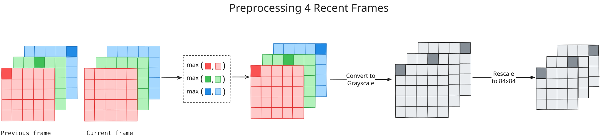
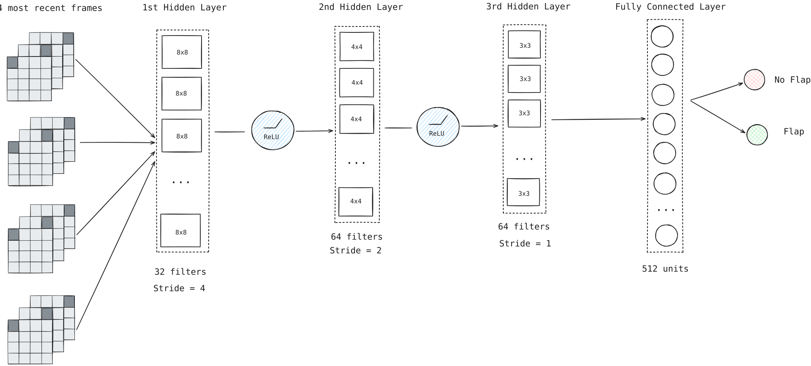

# Deep Q-Learning in Flappy Bird

Paper: https://arxiv.org/abs/1312.5602  
Code: https://github.com/google-deepmind/dqn

**Algorithm specification (ALGO-HC):** [ALGORITHM.md](ALGORITHM.md) — formal inputs/outputs, numbered steps, DQN/replay/target-network description (aligned with **[`algorithm/dqn.ipynb`](algorithm/dqn.ipynb)**), complexity, data structures, links to SVG flowcharts, Mermaid training-loop diagram, and test references.

**Layout:** Importable helpers live in this directory (`preprocessing.py`, package `deep_q_learning`). The convolutional DQN, replay buffer, ε-greedy agent, and `DQNTrainer` are implemented in **[`algorithm/dqn.ipynb`](algorithm/dqn.ipynb)** until extracted into `.py` modules. ([`tests/notebook.ipynb`](tests/notebook.ipynb) is optional scratch/experiments — use `algorithm/dqn.ipynb` as the canonical algorithm.)

## Plan

1. [x] Preprocessing: Implement and test preprocessing step (encode an RGB frame, rescale to 84×84) — see [`preprocessing.py`](preprocessing.py) and [`tests/test_preprocessing.py`](tests/test_preprocessing.py)
       
2. [x] DQN: Implement a class for DQN architecture using PyTorch (in [`algorithm/dqn.ipynb`](algorithm/dqn.ipynb))
       
3. [ ] Training:

## Install

From the `algorithms/` directory (so `deep_q_learning` is importable as a package):

```bash
pip install -r deep_q_learning/requirements.txt
pip install -r deep_q_learning/requirements-dev.txt
```

## Run tests

```bash
cd algorithms
python -m pytest deep_q_learning/tests -v
```

## Progress

- Replay memory is like storing past experiences and instead of learning from the most recent step, we learn from the memory later in random order
- There are 2 actions the bird can take at each frame: to flap or not to flap
- Currently, my understanding of this pipeline is as follow:
  1. Set up the flappy bird game environment from `gymnasium`
  2. Set up the convolutional neural net with the following structure:
     - CONV (16, 8x8, stride 4)
     - ReLU
     - CONV (32, 4x4, stride 2)
     - FC (252) -> output 1 scalar per action
  3. Then, we activates the game
  4. At each step, we collect 4 frames as the input phi of Q(phi, a)
  5. Then, we get 2 outputs: one when the bird flaps and one when the bird does not flap
  6. Then we get the reward r_t, next state and whether the game is over or not
  7. Then, we save (phi - 4 frames, a, r, next states, game state - done or not) in the replay memory array
  8. Then, we same a minibatch of 32 experiences from the large array

## Milestones

- [ ] Implement Q Network with random weights
- [ ] Implement replay memory
- [ ] Implement training loop
