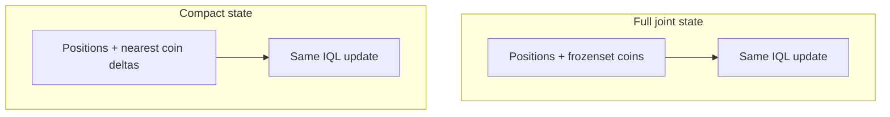
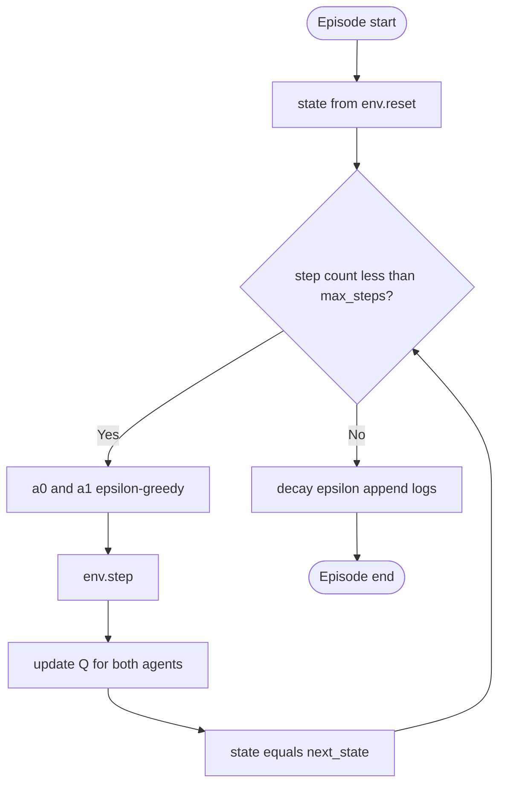

# Independent Q-Learning: Coin Collection (ALGO-HC)

This document maps the coursework checklist in [`ALGO-HC.md`](../../ALGO-HC.md) to [`algorithms/multiagent_rl/`](.): inputs/outputs, steps, two state representations, algorithm type, design rationale, properties, complexity, data structures, tests, flowcharts, and efficiency notes.

## Reference layout

| Subproject                                           | Role                                                                                                                                 |
| ---------------------------------------------------- | ------------------------------------------------------------------------------------------------------------------------------------ |
| [`independent-q-learning/`](independent-q-learning/) | **Full joint state:** agent positions + full coin configuration (`frozenset`).                                                       |
| [`compact_state/`](compact_state/)                   | **Compact state:** same rewards and IQL update, but state uses **nearest-coin (dr, dc)** per agent instead of enumerating all coins. |

Both share the same **Independent Q-Learning (IQL)** training loop pattern ([`training.py`](independent-q-learning/training.py) in each folder).

## 1. Two algorithms: full state vs. compact state

Both use **tabular Q-learning** with **decentralized execution**: two agents, each maintains its own Q-table and selects actions with ε-greedy; each treats the other agent as part of its environment.

They differ only in how the environment builds the **key** `s` (and `s'`) for each agent’s table.

|                      | **Full joint state**                                                      | **Compact state**                                                                                        |
| -------------------- | ------------------------------------------------------------------------- | -------------------------------------------------------------------------------------------------------- |
| **State tuple**      | `(pos0, pos1, frozenset(coin_positions))`                                 | `(pos0, pos1, delta0, delta1)` where `delta_k` is Manhattan-nearest coin offset `(dr, dc)` for agent `k` |
| **Typical tradeoff** | Exact coin layout; state space very large (many coin subsets × positions) | Many coin layouts map to the same `(pos, delta)`; smaller effective visited set; **lossy** abstraction   |
| **Code**             | [`independent-q-learning/env.py`](independent-q-learning/env.py)          | [`compact_state/env.py`](compact_state/env.py)                                                           |

**Non-stationarity:** From agent _i_’s perspective, transition dynamics change as agent _j_ learns—classic IQL does not address this; it is a deliberate baseline for teaching ([`agent.py`](independent-q-learning/agent.py)).

## 2. Inputs, outputs, and steps

### Inputs (from [`config.py`](independent-q-learning/config.py))

| Input                                           | Meaning                                                                                                                          |
| ----------------------------------------------- | -------------------------------------------------------------------------------------------------------------------------------- |
| `grid_size`                                     | N×N grid (default 6).                                                                                                            |
| `num_coins`                                     | Coins on board (respawn keeps count).                                                                                            |
| `cooperative`                                   | If true: +0.5 reward to **both** on any collection; if false: +1.0 to collector only.                                            |
| `num_episodes`, `max_steps`                     | Training horizon; episodes end after `max_steps` (environment returns `done=False` always from `step`; termination is external). |
| `alpha`, `gamma`                                | Q-learning step size and discount.                                                                                               |
| `epsilon_start`, `epsilon_end`, `epsilon_decay` | ε-greedy exploration schedule (per-episode multiplicative decay after each episode).                                             |

### Outputs

- Two **Q-tables** (one per agent), implemented as `defaultdict` mapping state → length-|A| NumPy vector.
- **Training logs:** per-episode rewards, coins collected, ε, TD error aggregates ([`training.py`](independent-q-learning/training.py)).
- Optional **plots and animations** via `plotting.py`, `visualization.py`, `main.py`.

### Numbered procedure (one episode)

1. `state ← env.reset()`.
2. For `t = 1 … max_steps`:
   - `a0 ← agent0.select_action(state)`, `a1 ← agent1.select_action(state)` (same observed state key for both).
   - `next_state, rewards, _, info ← env.step([a0, a1])`.
   - For each agent `i`: `agent_i.update(state, ai, rewards[i], next_state)`.
   - `state ← next_state`.
3. End episode: `decay_epsilon()` for both agents; log metrics.

See [`train()`](independent-q-learning/training.py) for the reference loop.

## 3. Algorithm type

- **Independent Q-Learning:** model-free, value-based, **off-policy** Q-updates with max over next actions; **not** a Nash solver or centralized joint controller.
- **Tabular:** no function approximation; states must be hashable (tuples / `frozenset`).

## 4. Properties (clarity, finiteness, robustness, termination, efficiency)

| Property    | Notes                                                                                                       |
| ----------- | ----------------------------------------------------------------------------------------------------------- |
| Clarity     | Separation: `config` → `env` → `agent` → `training` → analysis/plots.                                       |
| Finiteness  | Each episode has at most `max_steps` joint steps; each step does O(\|A\|) work per agent for greedy max.    |
| Termination | Episodes stop when the **training loop** exhausts `max_steps` (not `done` from env).                        |
| Robustness  | ε decay improves exploitation over time; IQL can be unstable under competition (non-stationarity).          |
| Efficiency  | Compact state reduces redundant keys and can improve sample efficiency vs. full `frozenset`; still tabular. |

## 5. Design rationale

- **Two folders** isolate one change (state encoding) so experiments compare **representation** without mixing code paths.
- **Shared agent logic:** [`QLearningAgent`](independent-q-learning/agent.py) is state-agnostic: any hashable `state` works.
- **Analysis / visualization** stay separate from the core RL loop for readability.

## 6. Complexity and efficiency

- **Per agent per step:** computing \(\max\_{a'} Q(s',a')\) is **O(|A|)** with \|A\| = 5 (up/down/left/right/stay).
- **Per episode:** **O(T · |A|)** per agent for updates, with T ≤ `max_steps`.
- **Memory:** grows with **distinct states visited**; full coin-set states grow faster than compact deltas in practice ([`compact_state/env.py`](compact_state/env.py) header comment).

### Proposed improvements (mostly not implemented)

- Centralized critic or **joint action** Q(s, a₁, a₂).
- **Communication** or opponent modeling.
- Function approximation for large state spaces.

**Implemented efficiency idea:** compact nearest-coin state in [`compact_state/`](compact_state/).

## 7. Data structures

| Structure                 | Use                                                                                 |
| ------------------------- | ----------------------------------------------------------------------------------- |
| `collections.defaultdict` | Lazy Q-table: new states get a zero vector of length `NUM_ACTIONS`.                 |
| `numpy.ndarray`           | Per-state Q-values, shape `(NUM_ACTIONS,)`.                                         |
| `tuple` / `frozenset`     | Hashable state keys (full env uses `frozenset` for coins).                          |
| `Config` dataclass        | Single place for hyperparameters ([`config.py`](independent-q-learning/config.py)). |

## 8. Readability conventions

- **snake_case** functions, **PascalCase** classes (`CoinCollectionEnv`, `QLearningAgent`, `TrainingLog`).
- Section headers in `agent.py` / `env.py` for scanability.
- ASCII banner in `main.py` for student-facing entry point.

## 9. Flowcharts

**High-level: full vs compact observation**



**Training step (two agents)**



For a printable figure, export Mermaid from a compatible tool.

## 10. Tests and edge cases

Install dev dependencies and run from **`algorithms/multiagent_rl/`** (see [`README.md`](README.md)):

```bash
pip install -r requirements.txt
pip install -r requirements-dev.txt
python -m pytest tests -v
```

[`pytest.ini`](pytest.ini) sets `addopts = -p no:langsmith` so environments with the LangSmith pytest plugin do not crash during test collection.

Automated tests:

- [`tests/test_independent_q_learning.py`](tests/test_independent_q_learning.py): **full-state** env `reset` / bounded `step`; Q `update` changes a value; greedy `select_action` picks argmax.
- [`tests/test_compact_state_smoke.py`](tests/test_compact_state_smoke.py): runs **compact_state** in a **subprocess** so its `env` module does not clash with `independent-q-learning` (same module name on `sys.path`).

**Manual smoke:** `python main.py --quick` inside [`independent-q-learning/`](independent-q-learning/) or [`compact_state/`](compact_state/).

## References

- Sutton & Barto, _Reinforcement Learning: An Introduction_ — multi-agent settings and non-stationarity.
- Littman, _Markov games_ — contrast with independent learners.
