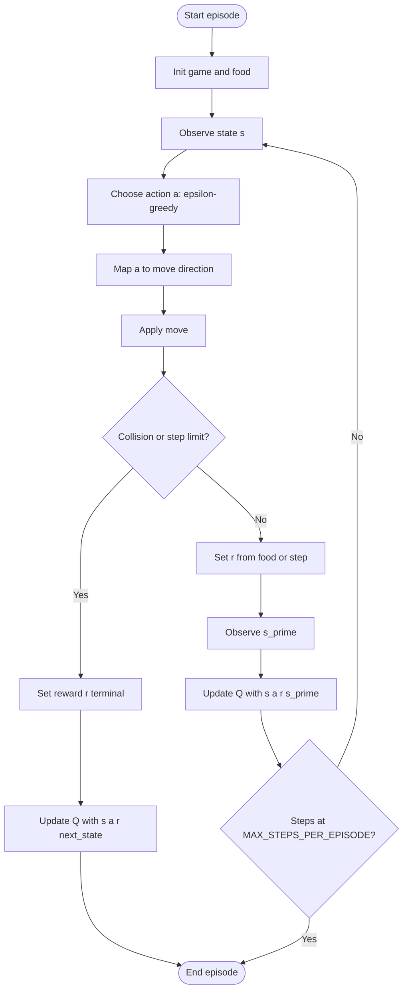

# Q-Learning for Snake: Algorithm Specification

This document satisfies the checklist in [`ALGO-HC.md`](../../ALGO-HC.md) for the implementation under this package: inputs/outputs, steps, algorithm type, design rationale, properties, complexity, data structures, tests, a flowchart, and proposed efficiency improvements.

## 1. Inputs, outputs, and steps

### Inputs

| Input                | Role                                                                                           |
| -------------------- | ---------------------------------------------------------------------------------------------- |
| Grid size `N`        | Square `N × N` board (`constants.GRID_SIZE`, default 4).                                       |
| Action set `A`       | Relative moves: `turn_left`, `go_straight`, `turn_right`, `turn_around` (`constants.ACTIONS`). |
| Learning rate `α`    | Step size for Q-updates (default `0.2` in `run_training`).                                     |
| Discount `γ`         | Weight on future value (`gamma` in `run_training`, e.g. `0.5` in `main.py`).                   |
| Exploration `ε`      | Probability of random action during training (`train_epsilon`).                                |
| Episode count        | Number of training (and evaluation) episodes (`NUM_EPISODES`).                                 |
| Step cap per episode | `MAX_STEPS_PER_EPISODE` (200) to force termination if the snake never dies.                    |

Rewards (see `QLearningAgent` in `agent.py`): `+10` when score increases (food), `0` on a normal step, `-10` on wall or self collision.

### Outputs

- **Q-table**: Mapping from state `s` to per-action values `Q(s, a)`, implemented as a nested structure keyed by a hashable state tuple `(head_pos, head_dir, body_tuple, food_pos)` and then by action name.
- **Learning curve data**: Per-episode evaluation scores returned by `run_training` and optionally plotted via `plot_learning_trajectories`.

### Numbered procedure (training step)

The training loop in `training.run_training` repeats the following for each training episode:

1. **Initialize episode**: Build `GameLogic`, place food, reset step counter.
2. **Observe state**: `get_state_representation(game)` → `s = (head, head_dir, body, food)`.
3. **Select action**: `choose_action(s, ε)` — with probability `ε` pick a uniform random action in `A`; else pick an action maximizing `Q(s, ·)` with deterministic tie-break using the order in `ACTIONS`.
4. **Map to physics**: `get_current_direction` → `get_direction(action, current_dir)` → absolute `(dr, dc)`.
5. **Environment step**: `game.move(direction)`. If move raises (wall/self), set reward to `-10`, define `s'` for the update (implementation uses the pre-move state as `next_state` for the terminal backup), apply `update_q_value(s, a, reward, next_state)`, and end the episode.
6. **Non-terminal step**: If move succeeds, reward `+10` if food eaten else `0`; `s' = get_state_representation(game)`; `update_q_value(s, a, reward, s')`.
7. **Step limit**: If steps reach `MAX_STEPS_PER_EPISODE`, break without necessarily a terminal reward on the last transition (episode ends).
8. **Evaluation** (same run): New game, `ε = 0`, roll out until death or step cap; record score.

## 2. Algorithm type

- **Tabular Q-learning**: Model-free **temporal-difference control**; estimates \(Q(s,a)\) without a model of transition probabilities.
- **Off-policy** in the usual sense for Q-learning: the backup uses **max** over actions at the next state, while behavior may be **ε-greedy** (stochastic exploration).

This fits Snake when the state space is **discretized** and enumerated (`generate_all_valid_states`): transitions are unknown but simulated by the game; we only need samples \((s, a, r, s')\).

## 3. Properties of a good algorithm

| Property        | How this implementation addresses it                                                                                                                                  |
| --------------- | --------------------------------------------------------------------------------------------------------------------------------------------------------------------- |
| **Clarity**     | Separation into `state_generation`, `game`, `agent`, and `training` mirrors MDP vs learner vs experiment; function names match roles.                                 |
| **Finiteness**  | Each episode performs finitely many iterations; each iteration does bounded work (table lookups, one backup).                                                         |
| **Termination** | An episode ends on collision, or after at most `MAX_STEPS_PER_EPISODE` steps.                                                                                         |
| **Robustness**  | Exploration via `ε` reduces getting stuck on a bad greedy policy early; rewards are bounded. Still sensitive to reward scale and `α`, `γ`, `ε` (standard RL caveats). |
| **Efficiency**  | Per-step cost is linear in \|A\| for the max over next actions; memory is driven by the size of the enumerated state space.                                           |

## 4. Strategy, decomposition, and ordering

- **`state_generation`**: Precomputes valid states so the Q-table can be initialized consistently with the chosen state encoding.
- **`game`**: Implements the environment (transitions, collisions, food), keeping simulation separate from learning rules.
- **`agent`**: Holds \(Q\), ε-greedy selection, and the Q-learning update—pure RL logic given \((s,a,r,s')\).
- **`training`**: Wires agent + environment, fixed hyperparameters, train-then-eval per episode, and plotting.

Ordering is deliberate: observe → act → reward → update is the standard **online** Q-learning pattern; evaluation after each training episode measures **exploitation** performance without exploration noise.

## 5. Tests and edge cases

Run from repo root (see `README.md`):

```bash
python -m pytest algorithms/q_learning/tests -v
```

Coverage includes:

- **State generation**: Neighbors, `dir_from`, placements, full state enumeration, counts by length (`test_state_generation.py`).
- **Game**: Initial snake, moves, wall/self collision, eating food (`test_game.py`).
- **Agent**: Default head direction for length-1 snake; relative→absolute directions; state tuple shape; Q-table init; missing-state Q reads as 0; greedy tie-break; numeric Q-update; **exploration with ε = 1**; **terminal-style next state** (max future Q = 0) (`test_agent.py`).

## 9. Flowchart (training step / episode)


